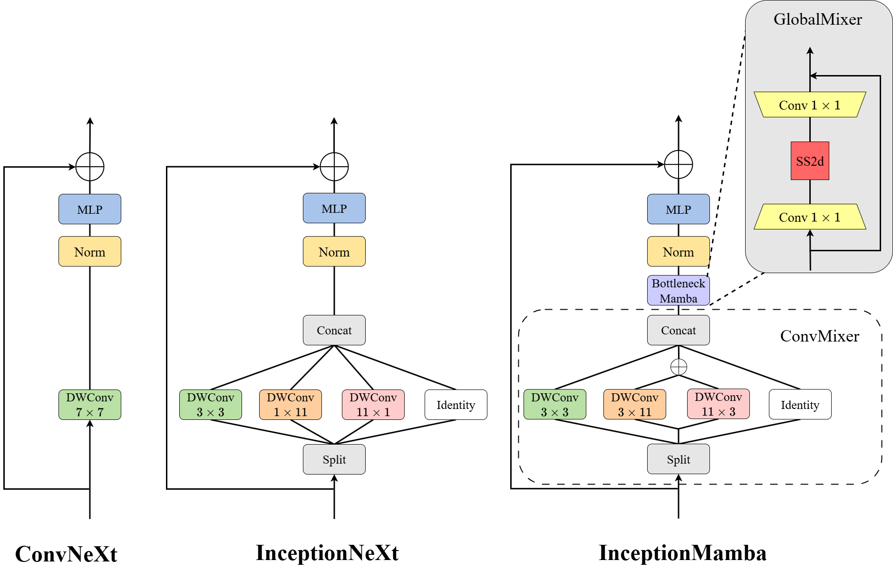
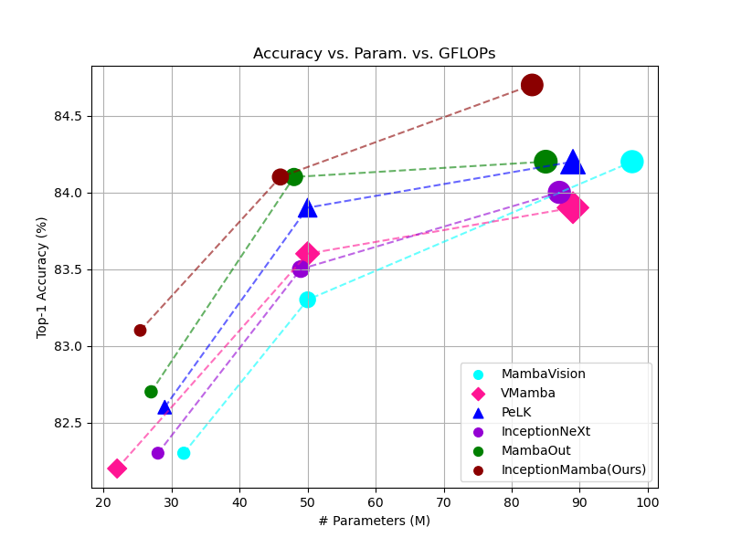

<h1>InceptionMamba </h1>
<h3>InceptionMamba: An Efficient Hybrid Network with Large Band Convolution and Mamba Bottleneck</h3>

Yuhang Wang<sup>1</sup>,
Jun Li<sup>1</sup>,
Zhijian Wu<sup>2</sup>
Jifeng Shen<sup>3</sup>
Jianhua Xu<sup>1</sup>
Wankou Yang<sup>4</sup>

<sup>1</sup>School of Computer and Electronic Information, Nanjing Normal University,
<sup>2</sup>Medical Artificial Intelligence Lab, Westlake University,
<sup>3</sup>School of Electrical and Information Engineering, Jiangsu University,
<sup>4</sup> School of Automation, Southeast University

Paper: ([arXiv 2401.10166](https://arxiv.org/abs/2401.10166))

> **Abstract:** Within the family of convolutional neural networks, InceptionNeXt has shown excellent competitiveness in image classification and a number of downstream tasks.
Built on parallel one-dimensional strip convolutions, however, it su ffers from limited ability of capturing spatial dependencies along different dimensions and fails to
fully explore spatial modeling in local neighborhood. Additionally, although InceptionNeXt excels at multi-scale spatial modeling capacity, convolution operations are
prone to locality constraints and inherently lack the global receptive field, which is detrimental to effective global context modeling. Recent research demonstrates that
Mamba based on state-space models can capture long-range dependencies while enjoying linear computational complexity. Thus, it is necessary to take advantage of
the Mamba architecture to improve the long-range modeling capabilities of the InceptionNeXt while maintaining desirable efficiency. Towards this end, we propose
a novel backbone architecture termed InceptionMamba in this study. More specifically, the traditional one-dimensional strip convolutions are replaced by orthogonal
band convolutions in our InceptionMamba to achieve cohesive spatial modeling. Furthermore, global contextual modeling can be achieved via a bottleneck Mamba module, facilitating enhanced cross-channel information fusion and enlarged receptive
field. Extensive evaluations on classification and various downstream tasks demonstrate that the proposed InceptionMamba achieves state-of-the-art performance with superior parameter and computational efficiency.

<div align="center">
  
</div>

<div align="center">
  
</div>

> **Top**: Illustrative comparison of ConvNeXt, InceptionNeXt, and our InceptionMamba block.
<br>
> **Bottom**:  Performance on ImageNet-1K validation set at $224^2$
resolutions.

------
# Classification results
### Image Classification for [ImageNet-1K](https://www.image-net.org):

| Model                                                                                                         | FLOPs | #Params | Resolution | Top-1 |
|---------------------------------------------------------------------------------------------------------------|:-----:|:-------:|:----------:|:-----:|
| InceptionNeXt-T                                                                                               | 4.2G  |   28M   | 224 x 224  | 82.3  |
| InceptionNeXt-S                                                                                               | 8.4G  |   49M   | 224 x 224  | 83.5  |
| InceptionNeXt-B                                                                                               | 14.9G |   87M   | 224 x 224  | 84.0  |
| VMamba-T                                                                                                      | 5.6G  |   22M   | 224 x 224  | 82.2  |
| VMamba-S                                                                                                      | 8.7G  |   50M   | 224 x 224  | 83.6  |
| VMamba-B                                                                                                      | 15.4G |   89M   | 224 x 224  | 83.9  |
| [InceptionMamba-T](https://github.com/Wake1021/InceptionMamba/releases/download/cls/inceptionmamba_tiny.pth)  | 4.0G  |   25M   | 224 x 224  | 83.1  |
| [InceptionMamba-S](https://github.com/Wake1021/InceptionMamba/releases/download/cls/inceptionmamba_small.pth) | 7.8G  |   46M   | 224 x 224  | 84.1  |
| [InceptionMamba-B](https://github.com/Wake1021/InceptionMamba/releases/download/cls/inceptionmamba_base.pth)  | 14.3G |   83M   | 224 x 224  | 84.7  |

# Downstream Results
## Object Detection and Instant Segmentation Results
### Object Detection  and Instant Segmentation Performance Based on [Mask-RCNN](https://openaccess.thecvf.com/content_ICCV_2017/papers/He_Mask_R-CNN_ICCV_2017_paper.pdf) for [COCO2017](https://cocodataset.org):

|     Backbone     | #Params | FLOPs | AP<sup>b</sup> | AP<sup>m</sup> |                                                          Cfg                                                           |                                                Log                                                |                                                  Model                                                  |
|:----------------:|:-------:|:-----:|:--------------:|:--------------:|:----------------------------------------------------------------------------------------------------------------------:|:-------------------------------------------------------------------------------------------------:|:-------------------------------------------------------------------------------------------------------:|
| InceptionMamba-T |   43M   | 233G  |      46.0      |      41.8      |  [cfg](https://github.com/Wake1021/InceptionMamba/releases/download/det/mask_rcnn_inceptionmamba_tiny_fpn_1x_coco.py)  |  [log](https://github.com/Wake1021/InceptionMamba/releases/download/det/inceptionmamba_tiny.log)  |  [model](https://github.com/Wake1021/InceptionMamba/releases/download/det/inceptionmamba_tiny_det.pth)  |
| InceptionMamba-S |   63M   | 301G  |      47.5      |      42.6      | [cfg](https://github.com/Wake1021/InceptionMamba/releases/download/det/mask_rcnn_inceptionmamba_small_fpn_1x_coco.py)  | [log](https://github.com/Wake1021/InceptionMamba/releases/download/det/inceptionmamba_small.log)  | [model](https://github.com/Wake1021/InceptionMamba/releases/download/det/inceptionmamba_small_det.pth)  |
| InceptionMamba-B |   99M   | 421G  |      48.1      |      43.1      | [cfg](https://github.com/Wake1021/InceptionMamba/releases/download/det/mask_rcnn_inceptionmamba_base_fpn_1x_coco.py)   | [log](https://github.com/Wake1021/InceptionMamba/releases/download/det/inceptionmamba_base.log)   | [model](https://github.com/Wake1021/InceptionMamba/releases/download/det/inceptionmamba_base_det.pth)   |

## Semantic Segmentation Results
### Semantic Segmentation Based on [UPerNet](https://arxiv.org/abs/1807.10221) for [ADE20k](http://sceneparsing.csail.mit.edu/):
|     Backbone     | #Params | FLOPs | mIoU(%) |                                                             Cfg                                                              |                                                 Log                                                  |                                                  Model                                                  |
|:----------------:|:-------:|:-----:|---------|:----------------------------------------------------------------------------------------------------------------------------:|:----------------------------------------------------------------------------------------------------:|:-------------------------------------------------------------------------------------------------------:|
| InceptionMamba-T |   53M   | 928G  | 47.3    |  [cfg](https://github.com/Wake1021/InceptionMamba/releases/download/seg/upernet_inceptionmamba_tiny_512x512_160k_ade20k.py)  | [log](https://github.com/Wake1021/InceptionMamba/releases/download/seg/inceptionmamba_tiny_seg.log)  |  [model](https://github.com/Wake1021/InceptionMamba/releases/download/seg/inceptionmamba_tiny_seg.pth)  |
| InceptionMamba-S |   73M   | 1006G | 49.2    | [cfg](https://github.com/Wake1021/InceptionMamba/releases/download/seg/upernet_inceptionmamba_small_512x512_160k_ade20k.py)  | [log](https://github.com/Wake1021/InceptionMamba/releases/download/seg/inceptionmamba_small_seg.log) | [model](https://github.com/Wake1021/InceptionMamba/releases/download/seg/inceptionmamba_small_seg.pth)  |
| InceptionMamba-B |  110M   | 1145G | 50.1    | [cfg](https://github.com/Wake1021/InceptionMamba/releases/download/seg/upernet_inceptionmamba_base_512x512_160k_ade20k.py)   | [log](https://github.com/Wake1021/InceptionMamba/releases/download/seg/inceptionmamba_base_seg.log)  | [model](https://github.com/Wake1021/InceptionMamba/releases/download/seg/inceptionmamba_base_seg.pth)   |

# Classification
## Environments
```shell
pip3 install torch==2.1.0 torchvision==0.16.0 torchaudio==2.1.0 --index-url https://download.pytorch.org/whl/cu121
pip3 install timm==0.6.11 fvcore
cd models/lib_mamba/kernels/selective_scan && pip install . && cd ../../../..
```
## Prepare ImageNet-1K Dataset
Download and extract [ImageNet-1K](http://image-net.org/) dataset in the following directory structure:

```
├── imagenet
    ├── train
        ├── n01440764
            ├── n01440764_10026.JPEG
            ├── ...
        ├── ...
    ├── train.txt (optional)
    ├── val
        ├── n01440764
            ├── ILSVRC2012_val_00000293.JPEG
            ├── ...
        ├── ...
    └── val.txt (optional)
```

Training scripts of models are shown in [scripts](/scripts/).

## Validation

To evaluate our InceptionMamba models, run:

```bash
MODEL=inceptionmamba_tiny
python3 validate.py /path/to/imagenet  --model $MODEL -b 128 \
  --pretrained
```
# Down-Stream Tasks
## Environments
```shell
pip3 install terminaltables pycocotools prettytable xtcocotools
pip3 install mmpretrain==1.2.0 mmdet==3.3.0 mmsegmentation==1.2.2
pip3 install mmcv==2.1.0 -f https://download.openmmlab.com/mmcv/dist/cu121/torch2.1/index.html
cd det/backbones/lib_mamba/kernels/selective_scan && pip install . && cd ../../../..
```

## Object Detection
### Train:

```
CUDA_VISIBLE_DEVICES=0,1,2,3,4,5,6,7 ./tools/dist_train.sh configs/mask_rcnn/mask_rcnn_inceptionmamba_tiny_fpn_1x_coco.py 8
```

### Test:

```
CUDA_VISIBLE_DEVICES=0,1,2,3,4,5,6,7 ./tools/dist_test.sh configs/mask_rcnn/mask_rcnn_inceptionmamba_tiny_fpn_1x_coco.py ./inceptionmamba_tiny_det.pth 8
```

## Semantic Segmentation
### Train:

```
CUDA_VISIBLE_DEVICES=0,1,2,3,4,5,6,7 ./tools/dist_train.sh configs/upernet/upernet_inceptionmamba_tiny_512x512_160k_ade20k.py 8
```

### Test:

```
CUDA_VISIBLE_DEVICES=0,1,2,3,4,5,6,7 ./tools/dist_test.sh configs/upernet/upernet_inceptionmamba_tiny_512x512_160k_ade20k ./inceptionmamba_tiny_seg.pth 8
```

## Citation

```
@misc{wang2025inceptionmambaefficienthybridnetwork,
      title={InceptionMamba: An Efficient Hybrid Network with Large Band Convolution and Bottleneck Mamba}, 
      author={Yuhang Wang and Jun Li and Zhijian Wu and Jianhua Xu},
      year={2025},
      eprint={2506.08735},
      archivePrefix={arXiv},
      primaryClass={cs.CV},
      url={https://arxiv.org/abs/2506.08735}, 
}
```

# Acknowledgements
We thank but not limited to following repositories for providing assistance for our research:
- [VMamba](https://github.com/MzeroMiko/VMamba)
- [InceptionNeXt](https://github.com/sail-sg/inceptionnext)
- [TIMM](https://github.com/rwightman/pytorch-image-models)
- [MMDetection](https://github.com/open-mmlab/mmdetection)
- [MMSegmentation](https://github.com/open-mmlab/mmsegmentation)